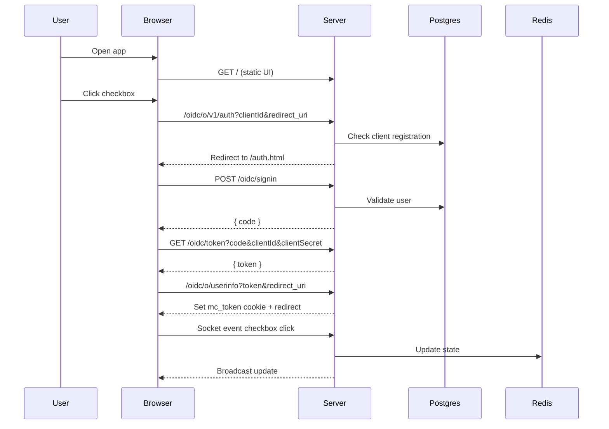

# 1 Million Checkboxes

A realtime checkbox wall with an OIDC-style auth flow. Users must sign in before they can toggle checkboxes. State is stored in Redis and updates are broadcast with Socket.IO.

## Quick start

1. Create a `.env` with `DATABASE_URL` and any Redis settings used by your `redis-connection.js`.
2. Install deps: `pnpm install`
3. Run migrations: `pnpm db:migrate`
4. Start the server: `pnpm run dev`
5. Open: `http://localhost:8000/`

## How it works (short)

- The UI loads from `public/index.html` and connects to Socket.IO.
- Clicking a checkbox triggers login if the user is not authenticated.
- The auth flow issues a code, then a JWT, and sets an HTTP-only cookie (`mc_token`).
- The backend verifies the cookie for checkbox updates and rate limits by user email.
- Checkbox state is stored in Redis and broadcast to all clients.

## Auth flow diagram

